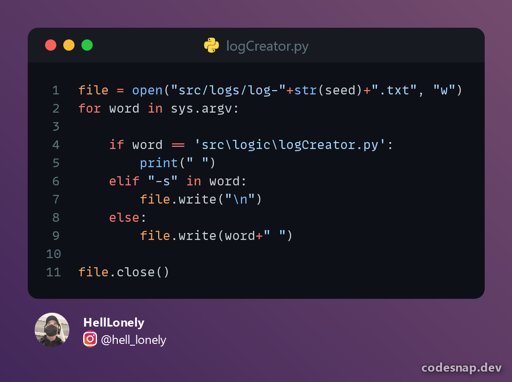

<h1 align="center">Tienda BMFlexing</>


<h2>Sistema de logs</h2>

Se crean archivos txt con los siguientes datos:

+ Fecha 
+ Error o Instrucción
+ Modulo

Para el sistema de los logs se usan dos archivos con distintios lenguajes.

+ logCreator.py
+ logSystem.java

Funciona a partir de una función que se encargar de ejecutar el codigo Python pasandole los parametros necesarios para crear el registro.




<h3>¿Cuando se crean los <strong>logs </strong>?</h3>

Los logs se crean cuando el usuario hace el **login** a la aplicación ```logButonActionPerformed()``` cuando adquiere alguno de nuestros productos u ocurre algun fallo en el programa.


