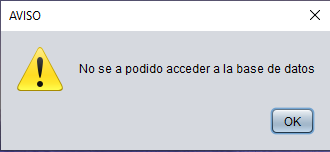

<h1 align="center">Tienda BMFlexing</h1>


<h2>Inicio y Login</h2>

En el momento que la aplicación se inicia la primera tarea que hace
es revisar si todas sus dependencias funcionan ````comprobarSistema()````
una de estas depencias es la base de datos, el programa lanzara una advertencia de que no hay conexión.


<div style="display: flex;justify-content:center">
    
</div>


<h2>Sistema de logs 📜</h2>

Se crean archivos txt con los siguientes datos:

+ Fecha 
+ Error o Instrucción
+ Modulo

Para el sistema de los logs se usan dos archivos con distintios lenguajes.

+ logCreator.py
+ logSystem.java

Funciona a partir de una función que se encargar de ejecutar el codigo Python pasandole los parametros necesarios para crear el registro.


<h3>¿Cuando se crean los <strong>logs </strong>?</h3>

Los logs se crean cuando el usuario hace el **login** a la aplicación ```logButonActionPerformed()``` cuando adquiere alguno 
de nuestros productos, cuando se crea un nuevo usuario ```createUserActionPerformed()```, ocurre algun fallo en el programa 
(e.j Fallo al conectar con la base de datos ```dataBaseTestConection()```).

<h3>Administración de logs</h3>

Por el momento la unica opción para gestionar los logs de la aplicación
se encuentra en las funcionalidades de **Admin**, que presenta un botón para
eliminar los logs ````clearLog()````


