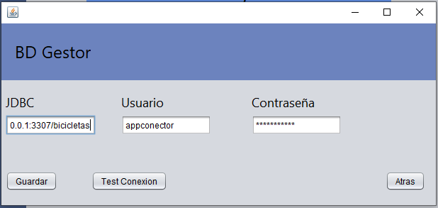
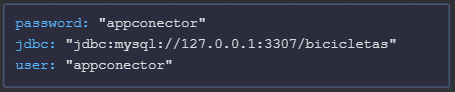

<h1 align="center">Tienda BMFlexing</h1>


<h2> Tecnologias 👨‍💻 </h2>

Todas las tecnologias usadas en el proyecto, junto a su version.

<table>
  <tr>
    <td align="center" >
        
      <br>MySql | 8.0.32
    </td>
    <td align="center" >
      
      <br>Java | JDK 17
    </td>
    <td align="center" >
        
      <br>Python | 3.9
    </td>
    <td align="center" >
        
      <br>Vagrant | 2.3.4
    </td>
    <td align="center" >
        
      <br>Markdown
    </td>
    <td align="center" >
        
      <br>GitHub
    </td>
    <td align="center" >
        
      <br>Figma
    </td>
  </tr>
</table>


<h2>Inicio y Login</h2>

En el momento que la aplicación se inicia la primera tarea que hace
es revisar si todas sus dependencias funcionan ````comprobarSistema()````
una de estas depencias es la base de datos, el programa lanzara una advertencia de que no hay conexión.


<div style="display: flex;justify-content:center">
    
</div>

Dando opción a cambiar los datos de conexion a la base de datos a los **Administradores** y al gestor de la base de datos. el cual se debe de conectar con el usuario -> "gestorBd" y contraseña -> "mysqlAdmin". Saliendo un panel que le permite configurar las credenciales de conexion.





<h2> Administración 👷‍♂️</h2>

Como en toda aplicación necesitamos administrar a los usuarios o el contenido de la base de datos.

Para administrar **BMFlexing** todos los administradores tendran un panel el cual podran realizar distintas tareas.

<ol>
    <li>Añadir recambios</li>
    <li>Añadir bicicletas</li>
    <li>Crear usuarios</li>
    <li>Gestionar Usuarios</li>
    <li>Crear administradores</li>
    <li>Gestionar administradores</li>
</ol>

<h3>Paquete de administración 📦</h3>

Todas estas herramientas estan alojadas en el paquete **adminToolsJFrames**.

Como su nombre indica las herramientas solo estan disponibles para administradores, funcionan gracias a un panel JFrame solo se muestra a los administradores autenticados.

Cada herramienta funciona como un objeto Java independiente que se crea y se elimina cada vez que se usa. Recordar importar el paquete para usarlo.

```java
adminToolsFacturas facturas = new adminToolsFacturas();
facturas.setVisible(true);
```

Si se quisiera usar el paquete de manera correcta en otras clases recordar importarlo, escogiendo solo una utilidad o todas.
```java
import adminToolsJFrames.adminToolsFacturas;
```


<h2>Sistema de logs 📜</h2>

Se crean archivos txt con los siguientes datos:

+ Fecha 
+ Error o Instrucción
+ Modulo

Para el sistema de los logs se usan dos archivos con distintios lenguajes.

+ logCreator.py
+ logSystem.java

Funciona a partir de una función que se encargar de ejecutar el codigo Python pasandole los parametros necesarios para crear el registro.

Aqui el script Python para crear los logs.

```python
file = open("src/logs/log-"+str(seed)+".txt", "w")
for word in sys.argv:

    if word == 'src\logic\logCreator.py':
        print(" ")
    elif "-s" in word:
        file.write("\n")
    else:  
        file.write(word+" ")
file.close()
```


<h3>¿Cuando se crean los <strong>logs </strong>?</h3>

Los logs se crean cuando el usuario hace el **login** a la aplicación ```logButonActionPerformed()``` cuando adquiere alguno 
de nuestros productos, cuando se crea un nuevo usuario ```createUserActionPerformed()```, ocurre algun fallo en el programa 
(e.j Fallo al conectar con la base de datos ```dataBaseTestConection()```).

<h3>Administración de logs</h3>

Por el momento la unica opción para gestionar los logs de la aplicación
se encuentra en las funcionalidades de **Admin**, que presenta un botón para
eliminar los logs ```clearLog()```

<h2> Librerias 📚</h2>

En el proyecto de estamos usadando por el momento 2 librerias.


<h3>SQL Connector</h3>

Esta librería esta usa en toda la clase **DAO**, es la encargada de realizar la conexion a una base de datos.

Cabe destacar que es necesario importar los métodos necesarios de la biblioteca, estos son los usados en nuestro proyecto.

```java
import java.sql.Connection;
import java.sql.DriverManager;
import java.sql.PreparedStatement;
import java.sql.ResultSet;
import java.sql.SQLException;
```
Aqui el link para obtener esta libreria - <a href="https://downloads.mysql.com/archives/c-j/">Link</a>

<h3>JSON Simple</h3>

La librería **JSON Simple** nos añade la funcionalidad leer y escribir ficheros JSON.

Un apunte que puede ser útil es que todos los metodos en los que usemos la librería necesitarán tener control de excepciones en su declaración.

>Ejemplo: Metodo para leer los datos del archivo config.json

```java
public static String[] jsonLecturaConnectionData() throws FileNotFoundException, IOException, ParseException {...}
```

Aqui el link para obtener esta libreria - <a href="http://www.java2s.com/Code/Jar/j/Downloadjsonsimple11jar.htm#google_vignette">Link</a>

<h2>Base de datos 🐬</h2>

Junto a la aplicación, la base de datos es uno de los pilares de este proyecto.

Esta hecha mediante MySQL WorkBench y Datagrip.

<h3> Estructura</h3>

La base de datos es ta formada por las tablas: 

| Tabla | Descripción|
|---|---|
|administrador| Todos los administradores con permisos de gestion de la aplicación y la base de datos|
|bicicleta| Artículo de venta conformado por recambios|
|factura| Información sobre las compras y sus usuarios|
|recambios| Artículo de venta |
|usuario| Cualquier usuario que use la aplicación|

Para mas detalle aquí el esquema Entidad-Relación


<h3> Usuarios BD </h3>

La seguridad de nuestra aplicación es lo más importante, nosotros optamos por la creación de dos usuarios gestores de la base de datos.

En nuestro caso llamada **bicicletas**.

<h4> Developer </h4>

Este tiene todos los permisos, y la capacidad de otorgarselos a otros administradores.

Comando de creación:

```sql
CREATE USER 'developer'@'%' IDENTIFIED BY 'developer';
GRANT ALL PRIVILEGES ON *.* TO 'developer'@'%' with grant option;
```
<h4> AppConector </h4>

Este usuario es el específico y el que se usa en la aplicación de manera local, solo tiene permisos para **Insertar, Actualizar, Consultar y Borrar** pero solo en la base de datos que usamos **bicicletas**.

```sql
CREATE USER 'appconector'@'%' IDENTIFIED BY 'appconector';
GRANT INSERT, DELETE, UPDATE, SELECT ON bicicletas.* TO 'appconector'@'%';
```
>**Nota**: Ambos usuarios se crean de manera automatica en Vagrantfile

<h2>¿Servidor Host o Virtual? 🤔</h2>

Al principio tuvimos dudas sobre si realizar el servidor de MySQL en nuestro equipo host u optar por uno Virtual.

Al final optamos por un servidor virtual ya que nos ofrece ventajas como el aislamiento del entorno, facilidad de configuración, portabilidad, escalabilidad y la capacidad de realizar experimentos y pruebas sin riesgos. Estas características hacen que esta opción sea una elección sólida para desarrollar nuestra aplicación.

Para crear el entorno virtual optamos por usar **Vagrant** y **VirtualBox**.

El equipo virtual cuenta con las siguientes especificaciones.

| Características| Descripción | Comando Vagrant |
|---|---|---|
|ISO |Ubuntu Mantic 64| ```config.vm.box = "ubuntu/mantic64"``` |
|CPU| 1 Procesador | ```vb.cpus = 1```|
|Memoria RAM| 1024 Mb | ```vb.memory = "1024"``` |
| Redirección de Puertos (NAT) | Enlace 3306 a 3307 | ```config.vm.network :forwarded_port, guest: 3306, host: 3307``` |
| Red Host-Only | Red con ip 192.168.0.100 | ```config.vm.network "private_network", ip: "192.168.0.100"```|

Documentación de la ISO - <a href="https://app.vagrantup.com/ubuntu/boxes/mantic64">Link</a>

Documentación de Vagrant - <a href="https://developer.hashicorp.com/vagrant/docs">Link</a>

A parte en el archivo de Vagrant se incluyen instrucciones para instalar el servidor de MySQL. Crear y configurar la base de datos **bicicletas** junto a los usuarios **developer** y **appconector**.

```shell
config.vm.provision "shell", inline: <<-SHELL
  sudo apt-get update
  sudo apt-get install -y mysql-server
end
```


<h2> DAO 🐬</h2>

En esta clase se almacenan todos los metodos que realizan alguna consulta a la base de datos. 

Esta clase consta de solo 3 atributos.

```java
    private static String connectionJDBC;
    private static String userSQL;
    private static String passwordSQL;
```

<h4>connectionJDBC</h4>
<p>A esta variable se le pasa el link del conector a la base de datos.</p>

```jdbc:mysql://ipDeDestino:puerto/baseDeDatos```

<h4>userSQL y passwordSQL</h3>

Son basicamente el usuario y la contraseña de la conexion a la base de datos.

<h3> Obtención de credenciales 🔐</h3>

Las variables para la conexión de la base de datos **userSQL**, **passwordSQL** y **connectionJDBC**, se obtienen del archivo **config.json**. Gracias a la libreria **JSON Simple 📚**.



> Foto hecha con VsCodeExtension:JSON Crack


<h3>Estructura básica de los metodos </h3>

Todos los metodos contiene una estructura llamada **try-width-resources**, que siempre probara a conectarse a la base de datos, pasando como parametros las variables antes mencionadas. 

``` Java
try (Connection conexion = DriverManager.getConnection(conectionIp, userSQL, passwordSQL);PreparedStatement ps = conexion.prepareStatement(sentenciaSQL))
```

Si la conexion es posible se ejecuta el contenido si no
devuelve el mensaje de error SQL ````e.getErrorCode() ````  obtener el codigo de error ````e.getSQLState()```` y el mensaje que nos devuelve  ````e.getMessage()```` .

A lo largo de todo el proyecto se utilizan varias consultas a la base de datos. Asi que nos parece correcto hacer una pequeña lista de todos los metodos de acceso para facilitar entender el código de manera externa.


<h3 style="margin-bottom:10px;">DAO 🐬 | Metodos usados</h3>


|Nombre|Descripción|
|---|---|
|```dataBaseTestConection()``` |Comprueba que la conexion con la base de datos.|
|```insertNewUser ()```|Inserta un nuevo usuario en la tabla usuario.
|```loginUser()```|Comprueba el nombre de usuario y contraseña para habilitar el **login**.|
|```loginAdmin()```|Comprueba el nombre de usuario y contraseña del usuario para loguearlo con los permisos de **Administrador**.|
|```getAdminTipo()```|Extrae el tipo de administrador de la sesión.|
|```insertRecambio()```|Crea un nuevo **Recambio** en la base de datos.|
|```modeloFactura()```|Consultar a Richard|
| ```actualizarPrecios()```|Consultar a Richard|
|```getUsuariosDatos()```|Obtiene la información del **Usuario** para mostrarlo en la aplicación.|
|```insertarFactura()```|Crea una nueva **Factura** en la base de datos.|
|```getIdCliente()```|Obtiene la id del **Usuario** mediante su nombre.|
|```piezasCuadro()```|Extrae todos los **Recambios** de tipo cuadro.|
|```piezasRuedas()```|Extrae todos los **Recambios** de tipo ruedas.|
|```piezasFrenos()```|Extrae todos los **Recambios** de tipo frenos.|
|```piezasShock()```|Extrae todos los **Recambios** de tipo shock.|
|```piezasHorquilla()```|Extrae todos los **Recambios** de tipo horquilla.|
|```getAdmins()```|Obtiene la información de todos los **Administradores**.|
|```deleteAdmin()```|Elimina a un **Administrador** mediante su id.|
|```promoteUser()```|Añade a un **Usuario** a la tabla de **Administradores**.|
|```getAllRecambios()```|Extrae la información de todos los **Recambios** mostrandolos en la aplicación.|
|```getRecambio()```|Extrae la información de un **Recambio**.|
|```updateRecambio()```|Modifica las informacion de un solo **Recambio**.|
